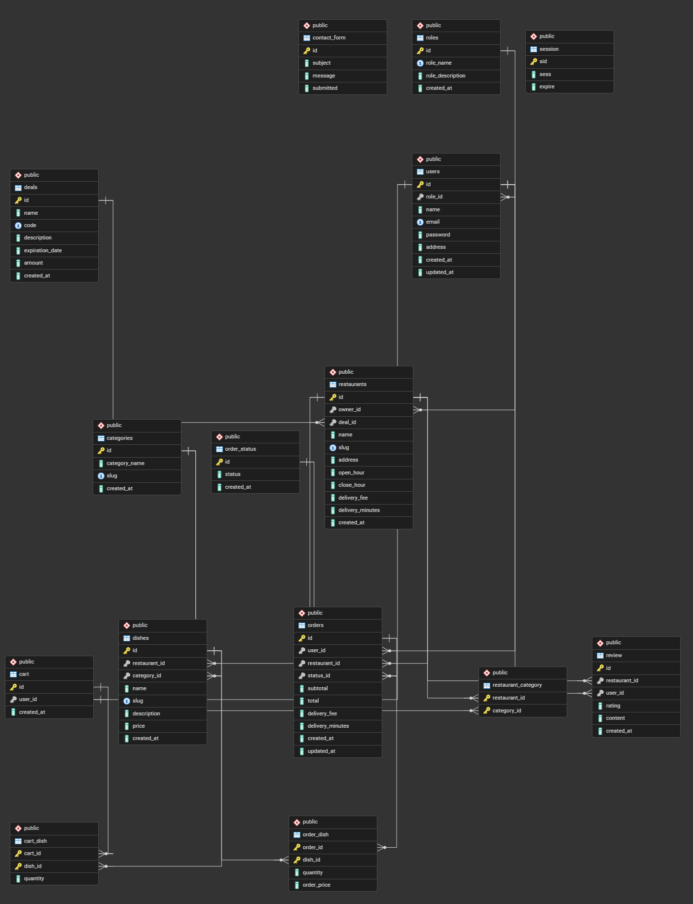

# Foodie

1. Project Description: This is a food delivery web application that allows users to browse restaurants, add items to their carts, and place orders online. It is for anyone who wants a convenient way to order food from home.

2. Database Schema:

3. User Roles
+ Admin: edit their own info, edit other user's info, view all contact forms, mark contact forms as read
+ Restaurant Owner: edit their own info, update ongoing orders' status, view their restaurant's info
+ Standard User: add items to cart, place orders online, leave review on restaurants, edit their own info, view order history, view their reviews

4. Test Account Credentials:
Admin email: admin@example.com
Restaurant Owner email: bubblehome.owner@example.com
User email: user1@example.com

5. Known Limitations: 
The search bar functionality hasn't been implemented yet.