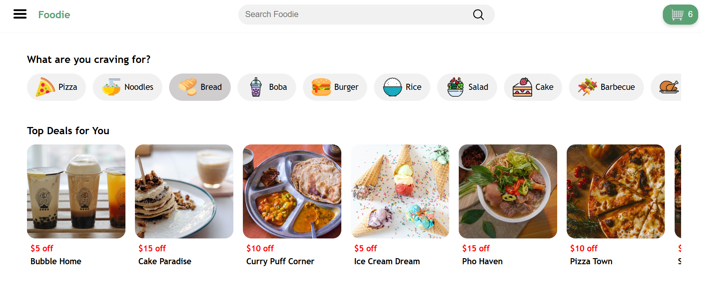
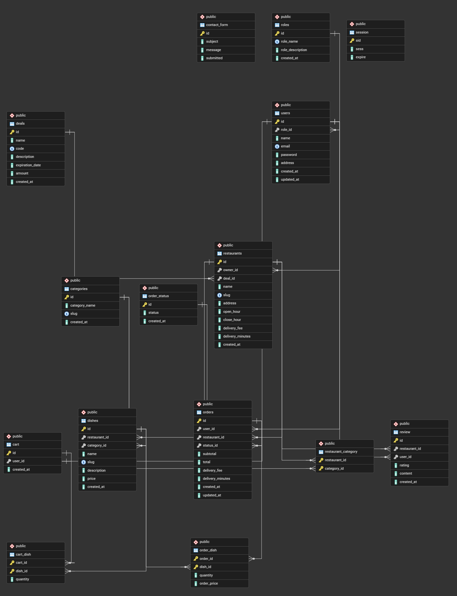

# Foodie 🍔

A full-stack food delivery web application inspired by DoorDash, 
built with Node.js, Express, and PostgreSQL.

## Live Demo
[foodie-u1mq.onrender.com](https://foodie-u1mq.onrender.com)

## Tech Stack
- **Frontend:** HTML, CSS, JavaScript (Vanilla)
- **Backend:** Node.js, Express.js
- **Database:** PostgreSQL (Supabase)
- **Architecture:** MVC, REST API

## Features
- Browse restaurants and menus
- Search dishes globally and within restaurants
- Add items to cart with real-time updates (no page reload)
- Place orders online
- Leave restaurant reviews
- User authentication and role-based access
- Admin and restaurant owner dashboards

## Screenshots

## Getting Started
1. Clone the repo
2. Run `npm install`
3. Create `.env` file with your database credentials
4. Run `npm start`

## Database Schema

## User Roles
+ Admin: edit their own info, edit other user's info, view all contact forms, mark contact forms as read
+ Restaurant Owner: edit their own info, update ongoing orders' status, view their restaurant's info
+ Standard User: add items to cart, place orders online, leave review on restaurants, edit their own info, view order history, view and delete their reviews

## Test Accounts
+ Admin email: admin@example.com
+ Restaurant Owner email: bubblehome.owner@example.com
+ User email: user1@example.com

## Known Limitations
+ Some user features haven't been completed, such as users editing their reviews, admins replying to contact form submissions, restaurant owners updating their restaurant information.

+ Some functions in the models folder need further refactoring to reduce repeated code and simplify complex queries.